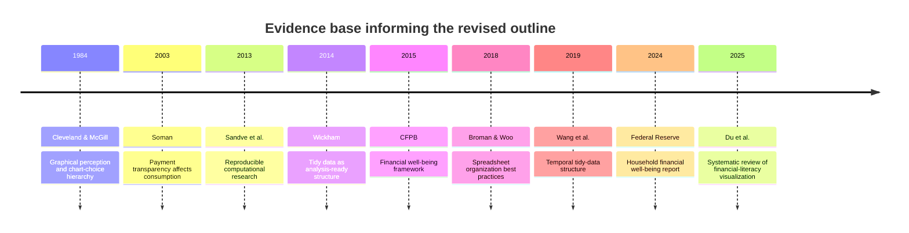

# Strengthened Evidence-Based Outline for the Personal Finance Analytics System

## Executive Summary

The uploaded outline already has a workable project structure, a defined dataset, and concrete summary metrics, but it is still closer to a project report draft than to a research-grounded academic outline. In its current form, it is under-cited, slightly over-descriptive, and methodologically thin in three places: theoretical framing, validation/reproducibility, and interpretation of behavioral findings such as payment-method effects. It also contains at least one classification issue that should be resolved before final submission: “Salary” appears among the top *expense* categories, which is conceptually inconsistent for a household-finance dataset unless the dataset is from an employer-cost perspective rather than a personal-finance perspective. fileciteturn0file0

The revised outline below reframes the project as a **reproducible personal-finance decision-support system**, not just a dashboard. It anchors the introduction and conclusions in financial well-being research, strengthens the data-cleaning section using established data-quality and tidy-data principles, incorporates better chart-selection logic from graphical-perception research, and adds a limitations/ethics/reproducibility section that is currently missing. Official and scholarly evidence also suggests that while better tracking and visualization can improve comprehension and engagement, causal evidence that dashboards alone improve long-term financial behavior remains limited or mixed; that ambiguity should be acknowledged directly in the paper. citeturn30view0turn12view0turn19view1turn28view0turn33search3turn8academia0

## Methodological Note

This revision was built from the user’s uploaded draft outline and a targeted evidence search emphasizing official reports and primary or near-primary scholarly sources. I prioritized authoritative domains and article landing pages from the Consumer Financial Protection Bureau, the Federal Reserve, the *Journal of Statistical Software*, and *PLOS Computational Biology*, then supplemented those with title- and author-based searches to surface relevant work commonly indexed in scholarly databases such as Google Scholar, Scopus, and PubMed-style search environments. Preference was given to recent sources from roughly the past decade, while retaining older seminal studies where they remain the field standard, especially for data visualization and payment-behavior theory. fileciteturn0file0 citeturn30view0turn12view0turn19view1turn28view0turn8academia0

## Revised Evidence-Based Outline

The following version keeps the spirit of the original draft while making it more rigorous, more defensible academically, and more explicitly connected to the literature. The title and section logic are revised so the project reads as an applied analytics study with methodological discipline, not only as a software demonstration. fileciteturn0file0 citeturn30view0turn19view1turn28view0

* **Proposed title**
  **Personal Finance Analytics System: Reproducible Data Cleaning, Behavioral Spending Analysis, and Decision-Support Visualization**
  This title is stronger than the original because it signals three scholarly contributions at once: data-quality processing, behaviorally informed financial interpretation, and reproducible analytics. That framing aligns better with the CFPB’s financial well-being construct and with the literature on tidy, reproducible analytic workflows. fileciteturn0file0 citeturn30view0turn19view1turn28view0

* **Introduction and rationale**
  The introduction should move beyond the generic claim that transaction logs are “hard to understand” and instead argue that transaction analytics matters because financial well-being depends on day-to-day control, the capacity to absorb shocks, progress toward goals, and freedom of choice. The CFPB explicitly frames financial well-being in those terms, while the Federal Reserve’s 2023 household well-being survey shows persistent stress from inflation and weakening financial resilience relative to 2021. A short sentence can then link dashboards and visualization to the practical communication of these patterns for users. citeturn30view0turn12view0turn8academia0

  **Suggested wording:**
  *Personal financial well-being is not determined by income alone, but by whether individuals can manage routine cash flows, absorb unexpected shocks, and stay on track toward financial goals. Transaction-level analytics can support these outcomes by transforming raw household records into interpretable measures of spending concentration, cash-flow volatility, and savings performance; however, such support is only credible when the underlying data are systematically cleaned, transparently modeled, and clearly visualized.* citeturn30view0turn12view0turn19view1turn33search3

* **Problem statement and research gap**
  The current problem statement correctly lists missing values, inconsistent labels, invalid dates, duplicates, invalid amounts, and outliers, but it should explicitly state why those issues matter: they threaten validity, comparability, and reproducibility. The data-cleaning literature emphasizes that dirty data can undermine downstream analysis, and tidy-data work shows that consistent structure is foundational to manipulation, modeling, and visualization. At the same time, the CFPB notes that rigorously identified links from financial knowledge and tools to financial outcomes are still not fully established, so the project should avoid overstating its behavioral impact. fileciteturn0file0 citeturn34academia0turn19view1turn30view0

  **Suggested wording:**
  *The core problem is not only that personal-finance data are messy, but that uncleaned transaction data can produce misleading summaries, invalid category comparisons, and non-reproducible conclusions. A secondary research gap is that many finance dashboards show spending data descriptively but do not document the cleaning logic, evaluate data validity, or connect interface choices to evidence on financial comprehension and decision support.* citeturn34academia0turn19view1turn28view0turn8academia0

* **Objectives and research questions**
  The original objectives are operationally sound, but they should be split into **data-quality**, **analytics**, and **evaluation** objectives. In academic form, the project should not only ask whether the system can load/clean/visualize data, but also whether its preprocessing logic is auditable and whether its outputs support interpretable decision-making. Reproducibility guidance strongly supports this stronger formulation. fileciteturn0file0 citeturn28view0turn19view1turn30view0

  **Suggested objective set:**
  *To build a reproducible analytics pipeline for personal-finance transactions; to evaluate the impact of data-cleaning decisions on descriptive financial metrics; to generate interpretable visual summaries of spending, income, and savings patterns; and to discuss how these summaries may support, but do not by themselves prove, better financial decision-making.* citeturn28view0turn19view1turn30view0

  **Suggested research questions:**
  *How do data-quality interventions change key financial indicators? Which categories, time periods, and payment methods dominate the user’s spending profile? Which visual encodings communicate these patterns most accurately and transparently?* citeturn19view1turn33search3turn21search1

* **Dataset description and data governance**
  This section should keep the raw-versus-cleaned table structure from the original outline, because it is already helpful, but it needs three additions: provenance, unit-of-analysis clarity, and governance. The paper should specify whether the dataset is personal, synthetic, anonymized, or classroom-generated; what one row represents; and how sensitive financial data are protected. This matters because transaction data can encode sensitive behavioral signals and even act as proxies for protected characteristics in downstream analytics. It is also important to clarify apparent semantic anomalies such as “Salary” appearing among top expenses. fileciteturn0file0 citeturn18search2turn36academia7

  **Suggested wording:**
  *The unit of analysis is the individual transaction record. The paper should document the source and status of the dataset (real, synthetic, or anonymized), the procedure used to protect personally identifiable information, and the assumptions governing category labels. Because category semantics directly affect interpretation, ambiguous labels such as “Salary” must be verified before reporting category rankings.* fileciteturn0file0 citeturn18search2turn36academia7

* **Methodology and analytic workflow**
  The methodology should be restructured as a reproducible pipeline rather than a narrative paragraph. The strongest version is: ingestion → schema validation → cleaning → feature engineering → exploratory analysis → descriptive metrics → dashboard rendering → validation and sensitivity checks. Tidy-data principles and temporal-data structuring are especially relevant here because your project uses year, month, period, and quarter fields. Reproducibility guidance also supports recording versions, parameters, intermediate outputs, and transformation logic. citeturn19view1turn33academia0turn28view0

  **Suggested subsection headings:**
  *Data ingestion and schema checks; cleaning and standardization; feature engineering; descriptive analytics; visualization design; validation and sensitivity analysis; deployment in Flask.* citeturn19view1turn33academia0turn28view0

* **Data cleaning and feature engineering**
  This section should be expanded from a list of cleaning tasks into a justification of *why* each task is necessary and *how* it may affect results. The current outline is strongest on practical detail, but it needs two methodological cautions. First, replacing missing text with “Unknown” is acceptable only when the paper distinguishes truly absent information from unresolved or invalid values. Second, outlier capping should not overwrite the raw source irreversibly; the paper should preserve the original amount, show the capping rule, and report at least a brief sensitivity comparison so readers can see whether major findings change materially. fileciteturn0file0 citeturn34academia0turn19view1turn28view0

  A further improvement is to stop treating all non-positive amounts as automatically invalid unless the dataset documentation proves that refunds, reversals, reimbursements, transfers, or corrections cannot occur. In personal-finance data, deleting such records without classification can distort net cash-flow interpretation. At minimum, the revised outline should say that exceptional values were **reviewed and categorized**, not simply discarded. fileciteturn0file0 citeturn28view0turn30view0

  **Suggested wording:**
  *Cleaning procedures included schema validation, date parsing, amount normalization, duplicate detection, controlled recoding of text fields, and explicit handling of exceptional cases. To preserve analytic transparency, raw transaction values were retained alongside cleaned values, outlier flags were recorded separately, and all transformation rules were documented so that summary statistics could be regenerated exactly.* citeturn34academia0turn19view1turn28view0

* **Analysis plan and financial metrics**
  The original metrics table is useful, but the paper should add a stronger interpretive bridge between descriptive statistics and financial well-being. Beyond total income, total expenses, and net savings, the analysis should report monthly cash-flow stability, spending concentration by category, the proportion of periods with positive net balance, and payment-method distributions. The rationale is that routine money management and financial planning are central drivers in the CFPB framework. The payment-method section is especially worth keeping because the literature suggests that less transparent payment mechanisms can be associated with higher spending or higher willingness to pay, although the exact size and mechanism vary by context. fileciteturn0file0 citeturn30view0turn21search1turn18academia1

  **Suggested additional metrics:**
  *monthly net-cash-flow variance; top-three-category spending concentration ratio; share of months with positive savings; median versus mean expense gap; flagged-transaction rate; and sensitivity of totals before versus after outlier treatment.* citeturn30view0turn28view0turn34academia0

* **Visualization and dashboard design**
  The dashboard section is where the largest evidence-based improvement is possible. The original draft includes a pie chart, but the graphical-perception literature has long shown that comparison by position on a common scale is generally more accurate than comparison by angles or areas, which means a sorted horizontal bar chart is usually better than a pie chart for category shares. A dashboard section should therefore justify each chart type rather than simply list it. Visualization research in financial-literacy contexts also suggests that design choices affect accessibility and understanding, not just aesthetics. fileciteturn0file0 citeturn33search3turn8academia0

  **Recommended chart set:**
  *sorted bar chart for top categories; line chart for monthly income, expenses, and net balance; histogram or boxplot for transaction distributions; bar chart for payment methods; and an anomaly/flag table for outliers, missing categories, or uncategorized transactions.* This revision improves interpretability and better matches the evidence on chart decoding accuracy. citeturn33search3turn25search9turn8academia0

* **Findings, discussion, and interpretation**
  The findings section should be split into **descriptive results** and **interpretive discussion**. In the descriptive component, keep the cleaned row count, totals, category shares, and payment-method shares from the current draft. In the discussion component, explain what those values imply for budgeting or monitoring, but state clearly that the results are descriptive of this dataset and do not prove causality. This matters especially because the CFPB literature notes that the pathway from financial knowledge/tools to real financial outcomes is complex and not fully identified. fileciteturn0file0 citeturn30view0turn12view0

  **Suggested wording:**
  *The dataset indicates persistent negative net savings across the observed period, with expenses exceeding income and spending concentrated in a small set of categories. These findings support the practical value of periodic budget monitoring and category-level review, but they should be interpreted as descriptive patterns within the available transaction history rather than causal evidence about the user’s long-run financial behavior.* fileciteturn0file0 citeturn30view0turn12view0

* **Limitations, ethics, and reproducibility**
  This is the most important section missing from the current outline. It should acknowledge that the dataset may be incomplete, category labels may be noisy, cleaning rules may alter downstream metrics, and visual summaries are only as valid as the preprocessing behind them. It should also note that personal transaction data are sensitive and can encode private attributes or fairness-relevant patterns, which makes documentation and access control important. Finally, the project should specify the reproducibility assets to be delivered: code, package versions, a data dictionary, sample inputs, and an audit log of transformations. citeturn36academia7turn28view0turn19view1

* **Conclusion and recommendations**
  The conclusion should not simply restate that Python, pandas, Plotly, and Flask were used. Instead, it should argue that the project demonstrates how reproducible preprocessing and evidence-based visualization can turn raw transactions into interpretable decision-support outputs. The recommendation section should also distinguish between **data recommendations** such as recoding ambiguous categories and **financial recommendations** such as monitoring category-specific budgets or review periods with unusually high variance. That distinction will make the paper more academic and less like an informal finance blog post. fileciteturn0file0 citeturn19view1turn28view0turn30view0

## Key Studies and Timeline

The studies and reports below are the most useful anchors for strengthening the outline because they map directly to your project’s weak points: conceptual framing, data tidiness, spreadsheet/data quality, reproducibility, chart choice, and spending interpretation. citeturn30view0turn12view0turn19view1turn28view0turn33search3turn21search1turn8academia0

| Authors                                          | Year | Design                                                       | Sample or data basis                                            | Main finding                                                                                                                                        | Direct relevance to the outline                                                                                                      | Source                         |
| ------------------------------------------------ | ---: | ------------------------------------------------------------ | --------------------------------------------------------------- | --------------------------------------------------------------------------------------------------------------------------------------------------- | ------------------------------------------------------------------------------------------------------------------------------------ | ------------------------------ |
| Consumer Financial Protection Bureau             | 2015 | Literature review, expert consultation, qualitative research | Existing literature plus nearly 60 hours of consumer interviews | Financial well-being is best understood as control over finances, ability to absorb shocks, progress toward goals, and financial freedom of choice  | Best source for reframing the introduction, discussion, and recommendations around financial well-being rather than raw totals alone | citeturn30view0turn12view1 |
| Board of Governors of the Federal Reserve System | 2024 | Official annual household survey report                      | 2023 SHED adult household survey                                | In 2023, 72% of adults were at least doing okay financially, but resilience remained below 2021 and 65% said price changes worsened their situation | Supports the real-world significance of household cash-flow monitoring and spending analysis                                         | citeturn12view0             |
| Wickham                                          | 2014 | Methods article                                              | Conceptual/statistical computing paper                          | Tidy datasets are easier to manipulate, model, and visualize; each variable should be a column and each observation a row                           | Strongest citation for the methodology and data-cleaning sections                                                                    | citeturn19view1             |
| Broman and Woo                                   | 2018 | Practice/methods article                                     | Spreadsheet-based data organization guidance                    | Better spreadsheet structure reduces downstream errors and makes analysis easier                                                                    | Useful for the dataset-description and data-governance section, especially if transactions originated in CSV or spreadsheet form     | citeturn18search2           |
| Sandve, Nekrutenko, Taylor, and Hovig            | 2013 | Methods/guidance article                                     | Reproducible computational workflow principles                  | Analysts should track workflows, avoid manual edits, archive versions, and preserve intermediates                                                   | Best support for adding reproducibility, auditability, and version control                                                           | citeturn28view0             |
| Cleveland and McGill                             | 1984 | Experimental graphical-perception study                      | Human chart-reading tasks                                       | Comparison by position on a common scale is generally more accurate than angle/area judgments                                                       | Strong evidence for replacing or de-emphasizing pie charts in the dashboard                                                          | citeturn33search3           |
| Soman                                            | 2003 | Quasi-experiments from the field                             | Consumer payment-behavior studies                               | Payment transparency affects consumption behavior                                                                                                   | Supports the rationale for analyzing payment methods, not just categories and dates                                                  | citeturn20search3           |
| Jiang                                            | 2022 | Field experiment, laboratory experiment, and meta-analysis   | Supermarket receipts, lab experiment, prior literature          | Relative to cash, mobile payment was associated with higher spending and higher willingness to pay in the study context                             | Useful but should be treated as moderate/emerging evidence when discussing digital payment behavior                                  | citeturn18academia1         |
| Wang, Cook, and Hyndman                          | 2019 | Methods paper                                                | Temporal-data modeling framework                                | Explicit time indexes and keys improve temporal data pipelines and modeling                                                                         | Supports your engineered year/month/quarter/period fields                                                                            | citeturn33academia0         |
| Du, Amor, Ma, and Wünsche                        | 2025 | Systematic review                                            | 37 papers on visualization for financial literacy               | Visualization can support financial understanding, but the field still has design and evaluation gaps                                               | Good support for the dashboard section and for acknowledging research gaps                                                           | citeturn8academia0          |

This timeline shows a coherent progression from foundational visualization and payment-behavior theory to more recent work on reproducibility, temporal-data structure, official financial well-being measurement, and visualization for financial literacy. citeturn33search3turn20search3turn28view0turn19view1turn30view0turn18search2turn33academia0turn12view0turn8academia0

## Evidence Strength and Research Gaps

The strongest evidence relevant to your paper is in three areas. First, the official household-finance literature clearly supports the importance of day-to-day money management, shock absorption, and financial goal progress as valid framing constructs for the project. Second, data-structuring and reproducibility work offers a mature methodological basis for insisting on tidy tables, explicit transformation logs, version control, and saved intermediate outputs. Third, classical visualization evidence strongly supports replacing imprecise encodings such as pie charts with bar or line charts where precise comparison matters. citeturn30view0turn12view0turn19view1turn28view0turn33search3

The evidence is moderate, but not uniformly conclusive, for claims that dashboards and financial visualizations improve user understanding or behavior. The recent systematic review on visualization for financial literacy is promising, but it also identifies design and evaluation gaps. Likewise, payment-method research often suggests that cashless or less transparent payments are associated with higher spending, yet mechanisms and effect sizes vary by payment form, task, and context. That means your paper should present payment-method findings as *interpretively informed* by behavioral literature, not as proof of a universal causal law. citeturn8academia0turn21search1turn18academia1turn30view0

The main research gaps your revised outline should acknowledge are straightforward. There is still limited long-term causal evidence that consumer-facing dashboards alone improve sustained financial outcomes; more user studies and longitudinal evaluations are needed. There is also a gap around how best to clean personal-finance exceptions such as transfers, refunds, and reversals without distorting net-flow analysis. Finally, privacy and fairness concerns are underdeveloped in most student analytics projects even though transaction data can reveal sensitive attributes and behavioral vulnerabilities. citeturn30view0turn34academia0turn36academia7turn8academia0

## Concrete Revisions to Improve the Draft

First, **replace the purely descriptive framing with a financial well-being framework**. The current outline explains what the system does, but not why those outputs matter conceptually. Anchoring the paper in the CFPB framework gives the introduction, findings, and conclusion a much stronger academic backbone. fileciteturn0file0 citeturn30view0turn12view0

Second, **turn the methodology into a reproducible analytic pipeline**. Right now the method section reads like a project narrative. It will be much stronger if it explicitly documents schema checks, transformation rules, parameter choices, outlier logic, saved intermediates, and software versions. That change improves academic credibility immediately. fileciteturn0file0 citeturn28view0turn19view1

Third, **audit semantic category validity before final reporting**. The appearance of “Salary” as an expense category is a red flag. If the dataset is truly about personal household finance, that category likely belongs under income, or it needs relabeling. If it is instead a payroll-cost dataset, then the title and interpretation need to change. In either case, this must be resolved before submission. fileciteturn0file0 citeturn18search2turn34academia0

Fourth, **redesign the visualization section around evidence-based chart choice**. Keep the trend line and category ranking visuals, but replace the pie chart with a sorted bar chart or treemap and explain why. This is one of the easiest ways to make the paper look more research-informed. fileciteturn0file0 citeturn33search3turn8academia0

Fifth, **add a limitations, ethics, and evaluation section**. This is the most substantive structural omission in the current draft. The final paper should state that the analysis is descriptive, that cleaning choices affect outputs, that transaction data are sensitive, and that future work should include user testing or usability evaluation of the dashboard rather than assuming usefulness. fileciteturn0file0 citeturn36academia7turn28view0turn8academia0

## APA Reference List

Board of Governors of the Federal Reserve System. (2024). *Economic well-being of U.S. households in 2023*. Federal Reserve System.

Broman, K. W., & Woo, K. H. (2018). Data organization in spreadsheets. *The American Statistician, 72*(1), 2–10. doi:10.1080/00031305.2017.1375989

Cleveland, W. S., & McGill, R. (1984). Graphical perception: Theory, experimentation, and application to the development of graphical methods. *Journal of the American Statistical Association, 79*(387), 531–554.

Consumer Financial Protection Bureau. (2015). *Financial well-being: The goal of financial education*. CFPB.

Consumer Financial Protection Bureau. (2015). *Measuring financial well-being: A guide to using the CFPB financial well-being scale*. CFPB.

Du, M., Amor, R., Ma, K.-L., & Wünsche, B. C. (2025). *Data visualization for improving financial literacy: A systematic review* [Preprint]. arXiv.

Jiang, Y. (2022). *The influence of payment method: Do consumers pay more with mobile payment?* [Preprint]. arXiv.

Kim, S. D., Andreeva, G., & Rovatsos, M. (2023). *The double-edged sword of big data and information technology for the disadvantaged: A cautionary tale from open banking* [Preprint]. arXiv.

Sandve, G. K., Nekrutenko, A., Taylor, J., & Hovig, E. (2013). Ten simple rules for reproducible computational research. *PLOS Computational Biology, 9*(10), e1003285. doi:10.1371/journal.pcbi.1003285

Soman, D. (2003). The effect of payment transparency on consumption: Quasi-experiments from the field. *Marketing Letters, 14*(3), 173–183.

Sun, Y., & Zhang, J. (2020). *Distance-based data cleaning: A survey* [Preprint]. arXiv.

Wang, E., Cook, D., & Hyndman, R. J. (2019). *A new tidy data structure to support exploration and modeling of temporal data* [Preprint]. arXiv.

Wickham, H. (2014). Tidy data. *Journal of Statistical Software, 59*(10), 1–23. doi:10.18637/jss.v059.i10

Runnemark, E., Hedman, J., & Xiao, X. (2015). Do consumers pay more using debit cards than cash? *Electronic Commerce Research and Applications, 14*(5), 285–291.

Prelec, D., & Simester, D. (2001). Always leave home without it: A further investigation of the credit-card effect on willingness to pay. *Marketing Letters, 12*(1), 5–12.
